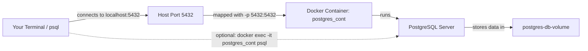

# Docker

**Docker is a platform for building, shipping, and running applications in containers.** A container is a lightweight, isolated environment that packages an application together with the libraries, tools, and runtime it needs. This makes it much easier to run software consistently across different machines.

For local development, Docker is especially useful because it helps you avoid the classic "but it works on my machine" problem. Instead of installing and configuring every dependency directly on your computer, you can run those dependencies in containers with a predictable setup.

In this lesson, we will use Docker to start a PostgreSQL database for the FastAPI application we will build in the next sections. The goal here is simple: get a database running, connect to it, and confirm that we can create and query data.

## Why Docker Is Useful Here

Without Docker, you would need to install PostgreSQL locally, manage its version, configure a database cluster, and make sure your app connects to the right place. Docker gives us a simpler path:

- use an official PostgreSQL image
- start a database container with one command
- expose the database on port `5432`
- persist the database files in a local folder
- tear everything down and recreate it when needed

This is a very common development workflow: run supporting services such as databases, caches, or message queues in containers while writing application code locally.

## Core Concepts

Before we start using commands, it helps to separate a few Docker terms that are easy to mix up.

| Term | Meaning in this lesson |
| --- | --- |
| **Dockerfile** | A recipe that tells Docker how to build an image |
| **Image** | A packaged template we can start containers from |
| **Container** | A running instance of an image |
| **Port mapping** | A link between a port on your machine and a port inside the container |
| **Environment variable** | A configuration value passed into the container at startup |
| **Volume / bind mount** | A way to store data outside the container so it survives restarts |

Another helpful way to think about it:

- The **Dockerfile** describes how to prepare the environment.
- The **image** is the prepared result.
- The **container** is the running process created from that image.

## What We Are About to Build

In this chapter, your local machine talks to a PostgreSQL server running inside a Docker container. The database data is stored in a local folder so that it is still there after the container stops.



## Creating a Dockerfile

This repository already contains a `Dockerfile` in the project root:

```Dockerfile
# Set the base image
FROM postgres:17

# Set the working directory
WORKDIR /app

# Expose the port
EXPOSE 5432

# Run the application
CMD ["postgres"]
```

This file is intentionally small because it builds on top of the official PostgreSQL image.

### What each line does

| Line | Purpose |
| --- | --- |
| `FROM postgres:17` | Use PostgreSQL 17 as the base image |
| `WORKDIR /app` | Set the working directory inside the container |
| `EXPOSE 5432` | Document that PostgreSQL listens on port `5432` |
| `CMD ["postgres"]` | Start PostgreSQL when the container runs |

The important idea here is that we are not installing PostgreSQL from scratch ourselves. We are reusing a trusted base image and adding only the minimal configuration we need.

## Building the Docker Image

### What we are doing

We are turning the `Dockerfile` into a Docker image that can later be used to start a container.

### Command

Run the following command from the project root. Make sure Docker Desktop is running first.

```bash
docker build -t postgres_im .
```

### What the command means

- `docker build` tells Docker to build an image
- `-t postgres_im` tags the image with the name `postgres_im`
- `.` tells Docker to use the current folder as the build context

### What to expect

Docker reads the `Dockerfile`, downloads the base image if needed, and creates a local image named `postgres_im`.

## Running the Database Container

### What we are doing

Now we are starting a container from the image we just built. This container will run PostgreSQL in the background.

### Command

```bash
docker run -d --name postgres_cont \
    -e POSTGRES_USER=postgres \
    -e POSTGRES_PASSWORD=postgres \
    -e POSTGRES_DB=fastapi_db \
    -v "$(pwd)/postgres-db-volume:/var/lib/postgresql/data" \
    -p 5432:5432 \
    postgres_im
```

### What the command means

| Part | Meaning |
| --- | --- |
| `docker run` | Start a new container from an image |
| `-d` | Run the container in detached mode, in the background |
| `--name postgres_cont` | Name the container `postgres_cont` |
| `-e POSTGRES_USER=postgres` | Set the database username |
| `-e POSTGRES_PASSWORD=postgres` | Set the database password |
| `-e POSTGRES_DB=fastapi_db` | Create `fastapi_db` on first startup |
| `-v "$(pwd)/postgres-db-volume:/var/lib/postgresql/data"` | Persist database files in a local folder |
| `-p 5432:5432` | Map host port `5432` to container port `5432` |
| `postgres_im` | Use the image named `postgres_im` |

### What to expect

Docker starts the container and returns a long container ID. PostgreSQL then continues running in the background.

Docker creates the `postgres-db-volume` folder automatically if it does not exist.

### Why the environment variables matter

The official PostgreSQL image reads these environment variables during its first startup:

- `POSTGRES_USER` sets the main database user
- `POSTGRES_PASSWORD` sets that user's password
- `POSTGRES_DB` creates a database automatically

That is why, in the default flow for this lesson, you do **not** need to create `fastapi_db` manually afterward.

## Host vs Container: One Common Point of Confusion

When you connect from your machine, you use `localhost` because the port is mapped to your host.

When a command runs **inside** the container, it talks directly to PostgreSQL within the container environment.

| Where the command runs | Host to use |
| --- | --- |
| On your machine with local `psql` | `localhost` |
| Inside the container with `docker exec` | No `localhost` needed |

## Checking That the Container Is Ready

### What we are doing

Before connecting, we want to make sure PostgreSQL has finished starting.

### Command

```bash
docker logs postgres_cont
```

### What to expect

Look for a message similar to: `database system is ready to accept connections`

Once you see that, the database is ready to use.

## Connecting to the Database

You can connect in one of two ways. Both connect to the same PostgreSQL server.

### Option 1: Use `psql` on your machine

#### What we are doing

We are connecting from your local machine through the mapped port `5432`.

#### Command

```bash
psql -h localhost -p 5432 -U postgres -d fastapi_db
```

#### What the command means

- `-h localhost` connects to your machine
- `-p 5432` uses PostgreSQL's port
- `-U postgres` connects as user `postgres`
- `-d fastapi_db` connects to the `fastapi_db` database

#### What to expect

You will be prompted for the password. Enter: `postgres`

### Option 2: Use `psql` inside the container

#### What we are doing

If `psql` is not installed on your machine, we can open the PostgreSQL client that already exists inside the container.

#### Command

```bash
docker exec -it postgres_cont psql -U postgres -d fastapi_db
```

#### What the command means

- `docker exec` runs a command inside a running container
- `-it` opens an interactive terminal
- `psql -U postgres -d fastapi_db` starts the PostgreSQL client

#### What to expect

You should land inside the `psql` prompt for the same database. This fallback is very handy when your host machine does not have PostgreSQL tools installed.

## Creating the Database

Because we started the container with `POSTGRES_DB=fastapi_db`, PostgreSQL already created the `fastapi_db` database for us on the first startup.

If you start a PostgreSQL container **without** `POSTGRES_DB`, you would first connect to the default `postgres` database and then create your own database manually:

```sql
CREATE DATABASE fastapi_db;
```

For this lesson, you do **not** need to run the command above.

## Creating the Table

### What we are doing

We are creating a simple `users` table inside `fastapi_db`.

### Command

```sql
CREATE TABLE IF NOT EXISTS users (
    id SERIAL PRIMARY KEY,
    name VARCHAR(50) NOT NULL,
    email VARCHAR(50) NOT NULL,
    password VARCHAR(50) NOT NULL
);
```

### What the command means

- `id` is an automatically increasing primary key
- `name`, `email`, and `password` are required text fields
- `IF NOT EXISTS` makes the command safe to run again if you repeat the lesson

### What to expect

PostgreSQL creates the `users` table if it is not already there.

## Inserting Data

### What we are doing

We are adding one sample row to the table.

### Command

```sql
INSERT INTO users (name, email, password)
VALUES ('John Doe', 'john.doe@example.com', 'password');
```

### What to expect

The row is inserted into the `users` table. If you run the command multiple times, you will insert multiple rows.

## Querying Data

### What we are doing

We are checking that the data was stored correctly.

### Command

```sql
SELECT * FROM users;
```

### What to expect

You should see the row you just inserted.

When you are done, exit `psql` with:

```text
\q
```

### Common `psql` commands

| Command | Description |
| --- | --- |
| `\l` | List all databases |
| `\c <db_name>` | Connect to a specific database |
| `\d` | List tables, views, and sequences |
| `\dt` | List tables |
| `\?` | Show `psql` commands |
| `\h` | Show SQL help, for example `\h SELECT` |
| `\q` | Quit `psql` |

## Stopping and Restarting the Container

### Stop the container

```bash
docker stop postgres_cont
```

### See running containers

```bash
docker ps
```

### Start the same container again later

```bash
docker start postgres_cont
```

Because we mounted a local folder as a volume, your database files stay on disk even after the container stops. That is why your data is still there after a restart.

## Starting Fresh

If you want to repeat the lesson from a completely clean state, stop and remove the container, then delete the local data directory:

```bash
docker rm -f postgres_cont
rm -rf postgres-db-volume
```

This removes the running container and deletes the persisted database files from your machine, so the next run starts from scratch.

## Summary

In this lesson, you:

- used a `Dockerfile` to define a PostgreSQL image,
- built that image with `docker build`,
- started a database container with `docker run`,
- connected to PostgreSQL with either local `psql` or `docker exec`,
- created a table, inserted data, and queried it,
- saw how a volume keeps data across container restarts.

We now have a PostgreSQL database running in Docker and can use it in the FastAPI application in the next lesson.
