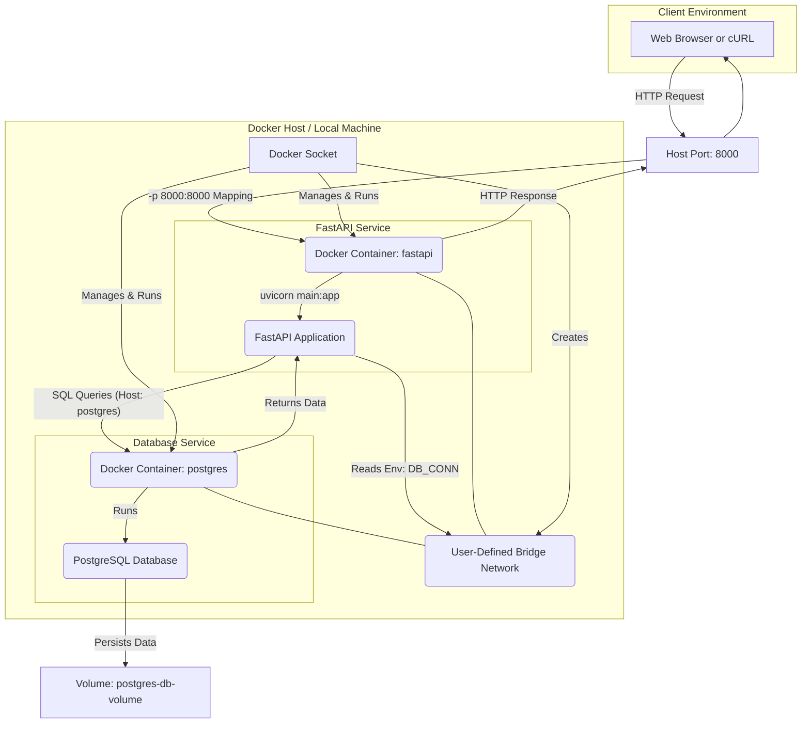

# Intro to APIs and Docker

This repository contains a notebook explaining how to work with JSON data, followed by a few Markdown lessons that walk through building a simple FastAPI app and containerizing it with Docker.

## Learning Path

- [01 - Intro to JSON](01-intro-to-json.ipynb): Introduction to JSON and how to read, modify, serialize, and validate JSON data.
- [02 - Intro to Docker](02-intro-to-docker.md): Small introduction to Docker and how to spin up a local PostgreSQL database with it.
- [03 - Intro to FastAPI](03-intro-to-fastapi.md): Introduction to FastAPI and how to create a simple REST API for your database.
- [04 - Intro to Docker - Part 2](04-intro-to-docker-part2.md): Containerize your API and connect it to your database manually.
- [05 - Intro to Docker Compose](05-intro-to-docker-compose.md): Introduction to Docker Compose and how to define a multi-container application automatically.

## Mermaid Diagrams

This repository contains Mermaid diagrams. If you want them to render in VS Code, we recommend installing the `Markdown Preview Mermaid Support` extension:

- [Install in VS Code](vscode:extension/bierner.markdown-mermaid)
- [View on Marketplace](https://marketplace.visualstudio.com/items?itemName=bierner.markdown-mermaid)

## Environment

Please make sure you **use this repository as a template** and set up a new virtual environment. You can use the following commands:

### **`macOS`**

```bash
pyenv local 3.11.3
python -m venv .venv
source .venv/bin/activate
python -m pip install --upgrade pip
python -m pip install -r requirements.txt
```

### **`Windows`**

For `PowerShell` CLI:

```PowerShell
pyenv local 3.11.3
python -m venv .venv
.venv\Scripts\Activate.ps1
python -m pip install --upgrade pip
python -m pip install -r requirements.txt
```

For `Git-Bash` CLI:

```bash
pyenv local 3.11.3
python -m venv .venv
source .venv/Scripts/activate
python -m pip install --upgrade pip
python -m pip install -r requirements.txt
```

The [requirements.txt](requirements.txt) file contains all libraries and dependencies needed to execute the notebooks.

## Setup

- You will need **Docker Desktop** installed and running on your machine. If you do not have it installed, please follow the [installation instructions](https://docs.docker.com/get-docker/).

- Installing **psql** is helpful if you want to connect to PostgreSQL from your machine, but the Docker lessons also include a `docker exec ... psql` fallback if you prefer not to install it locally.

### **`macOS`**

```sh
# To install psql
brew install postgresql@17

# To start services
brew services start postgresql@17

# To stop services
brew services stop postgresql@17
```

In case `psql` doesn't work:

```sh
brew install libpq
brew link --force libpq
```

### **`Windows`**

Please follow the [installation instructions](https://www.w3schools.com/postgresql/postgresql_install.php).

## Diagram

When you are done with the repository this is the structure you will have created:



## Learning Objectives

By the end of this repository, you should be able to:

- Explain the difference between JSON text and Python objects.
- Read, write, and validate JSON data in Python.
- Run PostgreSQL in Docker and connect to it from your machine or from inside a container.
- Build a small CRUD API with FastAPI, Pydantic, and SQLAlchemy.
- Containerize the FastAPI app with Docker.
- Connect multiple containers over a shared Docker network.
- Run the API and database together with Docker Compose.
